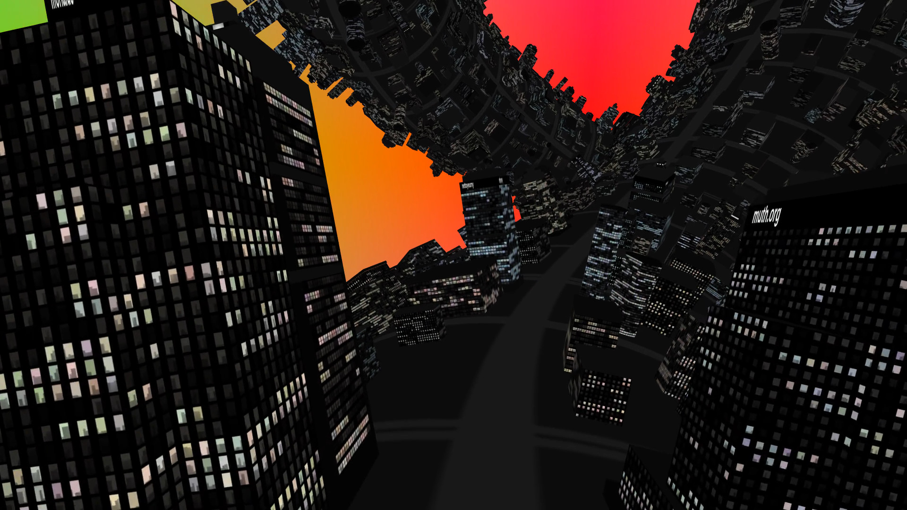

# City Knot (Twisted City Life)

This is a demo made for @party 2019 by Robert Muth (http://art.muth.org/) and Dietrich Epp (https://www.moria.us/). The demo consists of a exploring a cityscape wrapped around a torus knot.

Duration: about 3 min

Video: https://www.youtube.com/watch?v=asV6yIC_bsk

License: GPL see [LICENSE](LICENSE)

Released at [@party](http://atparty-demoscene.net) in June 2019.

Technologies: Dart, WebGL2

## Live Version

http://art.muth.org/twisted_city_life.html

( Developer Mode http://art.muth.org/twisted_city_life.html#develop )

## Development

Note: run `make` without arguments for more info

This program may have suffered a bit of “bit-rot” and may not build correctly with the latest versions of Dart packages. In our experience, it will still build correctly if versions from June 2019 are selected, and the project is built using those.

### Install SDK

Ubuntu: package `dart``

Other platforms: https://dart.dev/tutorials/web/get-started (Section 2. Install Dart)

update PATH in Makefile

### Install Demo Dependencies

make get

### Development Build

make serve

(launches web server with just-in-time-transpiling)

Navigate to localhost:8080/delta.html

### Release Build

make build_release

make zipball (optional)

make serve_release

Navigate to localhost:8080/delta.html
